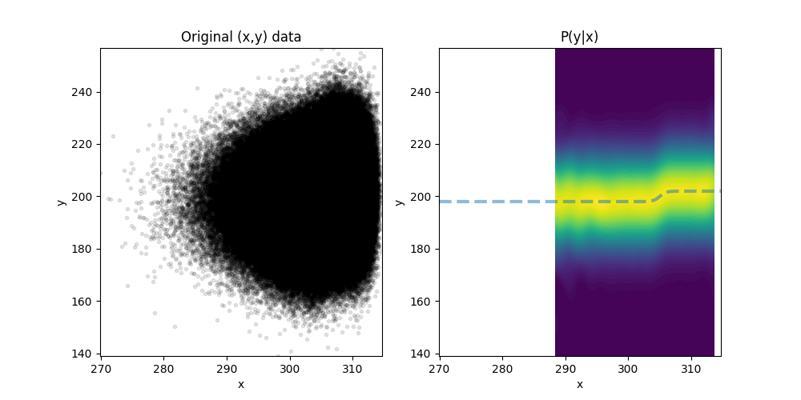

# fastKDE #

## Software Overview ##

Calculates a self-consistent probability density estimate of arbitrarily
dimensioned data. By default, this imlementation uses a multidimensional
version of the nuFFT-based Empirical Characteristic Function calculation
described by O'Brien et al. (2014; Computational Statistics and Data Analysis,
doi:10.1016/j.csda.2014.06.002), which improves the speed of the
self-consistent density esimate described by Bernacchia and Pigolotti (2011; J.
Royal Statistical Society C, doi:10.1111/j.1467-9868.2011.00772.x)

Example usage:

###For a standard PDF

```
#!python
 
import numpy as np
import fastKDE
import pylab as P

#Generate two random variables dataset (representing 100000 pairs of datapoints)
N = 2e5
var1 = 50*np.random.normal(size=N) + 0.1
var2 = 0.01*np.random.normal(size=N) - 300
  
#Do the self-consistent density estimate
myPDF,axes = fastKDE.pdf(var1,var2)

#Extract the axes from the axis list
v1,v2 = axes

#Plot contours of the PDF should be a set of concentric ellipsoids centered on
#(0.1, -300) Comparitively, the y axis range should be tiny and the x axis range
#should be large
P.contour(v1,v2,myPDF)
P.show()

```

###For a conditional PDF

**The following code generates samples from a non-trivial joint distribution**
```python
from numpy import *

#***************************
# Generate random samples
#***************************
# Stochastically sample from the function underlyingFunction() (a sigmoid):
# sample the absicissa values from a gamma distribution
# relate the ordinate values to the sample absicissa values and add
# noise from a normal distribution

#Set the number of samples
numSamples = int(1e6)

#Define a sigmoid function
def underlyingFunction(x,x0=305,y0=200,yrange=4):
return (yrange/2)*tanh(x-x0) + y0

xp1,xp2,xmid = 5,2,305  #Set gamma distribution parameters
yp1,yp2 = 0,12          #Set normal distribution parameters (mean and std)

#Generate random samples of X from the gamma distribution
x = -(random.gamma(xp1,xp2,int(numSamples))-xp1*xp2) + xmid
#Generate random samples of y from x and add normally distributed noise
y = underlyingFunction(x) + random.normal(loc=yp1,scale=yp2,size=numSamples)
```

**Now that we have the x,y samples, the following code calcuates the conditional**
```python
#***************************
# Calculate the conditional
#***************************
pOfYGivenX,axes = fastKDE.conditional(y,x)
```

The following plot shows the results:


## How do I get set up? ##

A standard python build:
```python setup.py install```

### Download the source ###

Please contact Travis A. O'Brien <TAOBrien@lbl.gov> to obtain the latest version of the source.

### Install pre-requisites ###
This code requires the following software:
  
  * Python >= 2.7.3
  * Numpy  >= 1.7
  * scipy
  * cython
